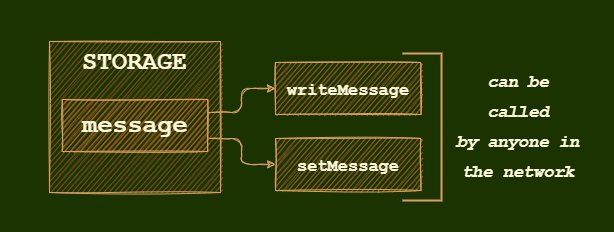
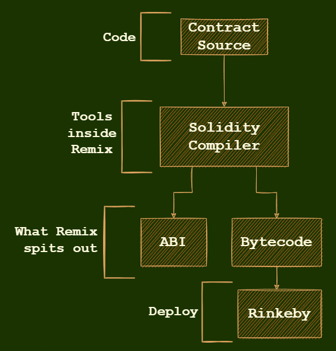

<!-- <div align="center">
    
</div>

<br/> -->
<br/>

# Common Function Types

| Function   |      Behavior      | 
|----------|:-------------:|
| public |  anyone can call this f() | 
| private |  Only this contract can call this f() | 
| view |  Return data and can't change it | 
| constant | Return data and can't modify it |
| pure | Can't modify or read tthe contract's data |
| payable | When call this f() send ether along |

<br/>

# Write Message in Blockchain


```js
// SPDX-License-Identifier: MIT
pragma solidity >=0.7.0 <0.9.0;

contract Inbox {
    // This variable is going to live in the blockchain
    string public message;
    
    // User is going to fill this variable value 
    function writeMessage(string memory initialMessage ) public {
        message = initialMessage;
    }
    // in this case setMessage ACCEPTS an argument
    // if it's called with STRING is going to be assigned to newMessage
    function setMessage(string memory newMessage) public {
        message = newMessage;
    }
    // in this case getMessage DOES NOT ACCEPT arguments
    function getMessage() public view returns (string memory) {
        return message;
    }
}

```
<br/>

# Function behavior

<div>



</div>

<br/>

# Deployment

<div>



</div>

